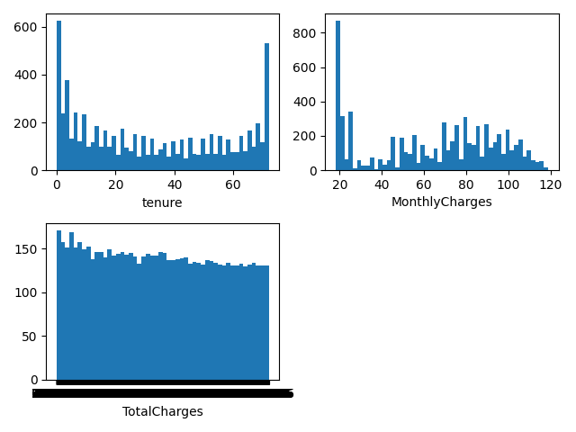
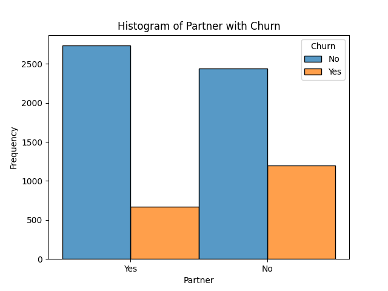
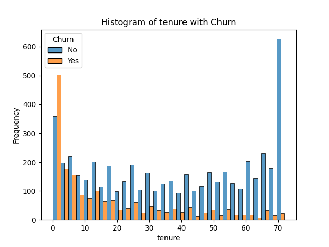
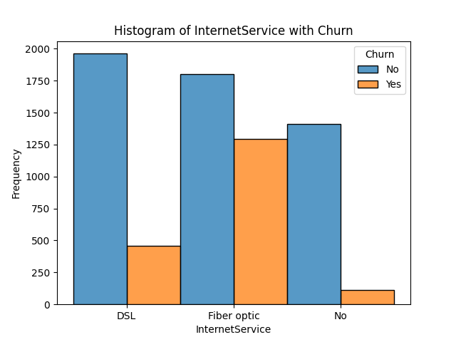
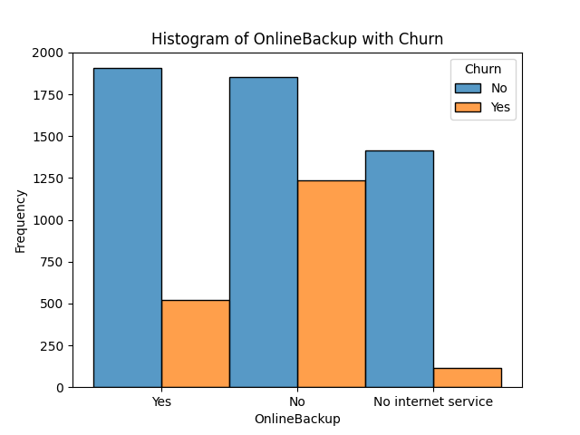
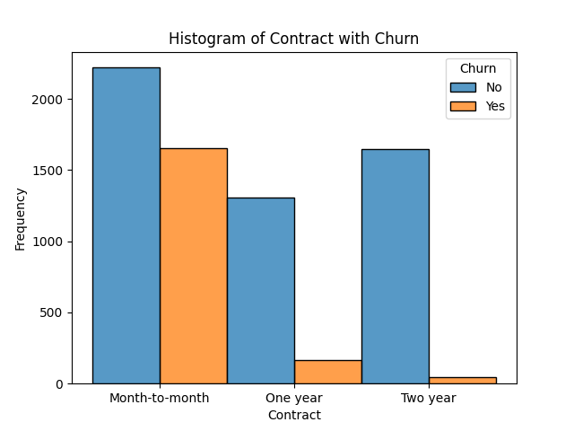
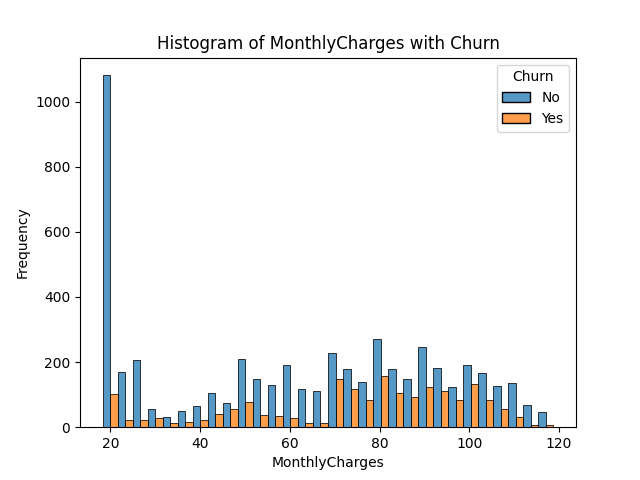
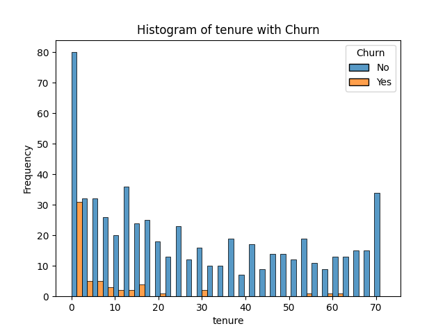
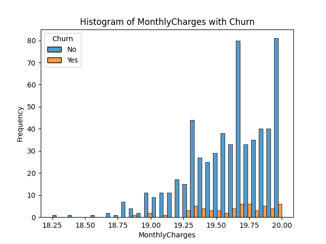

# 顧客流失率分析 Customer-Churn 
來源取至Kaggle:Telco Customer Churn

https://www.kaggle.com/datasets/blastchar/telco-customer-churn/discussion

以下是我們之後會用到的包
```
import numpy as np
import pandas as pd
import matplotlib.pyplot as plt

from sklearn.model_selection import train_test_split 
from sklearn.preprocessing import LabelEncoder, MinMaxScaler

import pickle
from sklearn.svm import SVC
from sklearn.metrics import classification_report, confusion_matrix
```

# 前處理

先來看看表格屬性有什麼
```
columns=data_pd.columns
print(columns)
```

```
Index(['customerID', 'gender', 'SeniorCitizen', 'Partner', 'Dependents',
       'tenure', 'PhoneService', 'MultipleLines', 'InternetService',
       'OnlineSecurity', 'OnlineBackup', 'DeviceProtection', 'TechSupport',
       'StreamingTV', 'StreamingMovies', 'Contract', 'PaperlessBilling',
       'PaymentMethod', 'MonthlyCharges', 'TotalCharges', 'Churn'],
      dtype='object')
```

檢查看看有沒有缺失的檔案要padding
```
for name in columns:
    cond1=data_pd.isnull()[name]==True
    print(data_pd[cond1])
```

```
Index: []
Empty DataFrame
```
看來是沒有

來粗略看一下有多少元素
```
print(data_pd.nunique())
for name in data_pd.columns:
    print(pd.unique(data_pd[name]))
```

```
customerID          7043
gender                 2
SeniorCitizen          2
Partner                2
Dependents             2
tenure                73
PhoneService           2
MultipleLines          3
InternetService        3
OnlineSecurity         3
OnlineBackup           3
DeviceProtection       3
TechSupport            3
StreamingTV            3
StreamingMovies        3
Contract               3
PaperlessBilling       2
PaymentMethod          4
MonthlyCharges      1585
TotalCharges        6531
Churn                  2
dtype: int64
```
```
['7590-VHVEG' '5575-GNVDE' '3668-QPYBK' ... '4801-JZAZL' '8361-LTMKD'
 '3186-AJIEK']
['Female' 'Male']
[0 1]
['Yes' 'No']
['No' 'Yes']
[ 1 34  2 45  8 22 10 28 62 13 16 58 49 25 69 52 71 21 12 30 47 72 17 27
  5 46 11 70 63 43 15 60 18 66  9  3 31 50 64 56  7 42 35 48 29 65 38 68
 32 55 37 36 41  6  4 33 67 23 57 61 14 20 53 40 59 24 44 19 54 51 26  0
 39]
['No' 'Yes']
['No phone service' 'No' 'Yes']
['DSL' 'Fiber optic' 'No']
['No' 'Yes' 'No internet service']
['Yes' 'No' 'No internet service']
['No' 'Yes' 'No internet service']
['No' 'Yes' 'No internet service']
['No' 'Yes' 'No internet service']
['No' 'Yes' 'No internet service']
['Month-to-month' 'One year' 'Two year']
['Yes' 'No']
['Electronic check' 'Mailed check' 'Bank transfer (automatic)'
 'Credit card (automatic)']
[29.85 56.95 53.85 ... 63.1  44.2  78.7 ]
['29.85' '1889.5' '108.15' ... '346.45' '306.6' '6844.5']
['No' 'Yes']
```

#單變數分布可視化

從以上可以得知，連續性的資料有這三項
```
data_pd_numberical=data_pd[['tenure','MonthlyCharges','TotalCharges']]
```
首先我們可以sub polt一下
```
features=data_pd_numberical.columns
for i in range(0, len(features)):
    plt.subplot(2, len(features)//2 + 1, i+1)
    plt.hist(data_pd_numberical[features[i]], bins=50)
    plt.xlabel(features[i])
plt.show()
```


1. 從Tenure可以看到有雙峰的情況，大多數人群要馬就是持有很久或是剛持有
，市場策略可以對這兩種族群進行處理

2. 從MonthlyCharges可見大多數人為低資費，並且從40開始到120結束有呈一個常態分佈
意味著收費策略可以對這兩種族群進行處理

3. TotalCharge 是一個均勻分布

# 回顧率分析與可視化
我們將雙變數或是多變數做直方圖
```
features = ['gender', 'SeniorCitizen', 'Partner', 'Dependents',
       'tenure', 'PhoneService', 'MultipleLines', 'InternetService',
       'OnlineSecurity', 'OnlineBackup', 'DeviceProtection', 'TechSupport',
       'StreamingTV', 'StreamingMovies', 'Contract', 'PaperlessBilling',
       'PaymentMethod', 'MonthlyCharges', 'TotalCharges']
for feature in features:
    sns.histplot(data = data_pd, x = feature, hue = 'Churn', multiple = 'dodge', bins=30)
    plt.title(f'Histogram of {feature} with Churn')
    plt.xlabel(feature)
    plt.ylabel('Frequency')
    plt.show()
```
直接說重點
1. 大部分的項目 不願意續簽的人>願意續簽 這也是我們想要理解的問題
2. 願不願意續約與性別無關
3. 不願意續約的群體以年輕人為大宗
4. 願意續約的群體以單身人群為多數，不願意續約的群體以有伴侶的人為多數
<div align=center></div>
5. 願意續約的群體以有家人的為多數
6. 呈之前tenure提過的，一多數群體為新戶，從70開始突然出現多數退約，值得注意
<div align=center></div>
7. 無論是無續約，使用電話服務的群體為大宗。

8. 願不願意續約與有無使用多線服務可能無關
<div align=center></div>
9.  在願意續約的群體以光纖網路為大宗，在不願意續約的群體以DSL為大宗
意味著群體的轉化或許可以透過推廣服務進行

10. 願不願意續約與在線安全服務無關
    
11. 在願意續約的群體，以沒有網路備份為大宗
<div align=center></div>

12. 有無定閱資安服務或是串流看起來與願不願意續約沒什麼關係
<div align=center></div>
13. 訂閱時間以第一年開始大量跳樓

14. 有無續約都以紙本服務為多數

15. 有續約的群體以電子支票為多數

16. 從資費為20附近為拒絕續約的最大宗
    
<div align=center></div>
# 特例: 資費小等於20
再來我們從資費小等於20為拒絕續約的最大宗為條件，在重新看一次分布去了解問題

我們可以懷疑也許費率是一個影響最大的因素

於是我們將資費變成一個控制變因，再從頭來看有沒有還可以把握什麼次要的因素

```
cond=data_pd['MonthlyCharges']<=20
new_df=data_pd[cond]
features = ['gender', 'SeniorCitizen', 'Partner', 'Dependents',
       'tenure', 'PhoneService', 'MultipleLines', 'InternetService',
       'OnlineSecurity', 'OnlineBackup', 'DeviceProtection', 'TechSupport',
       'StreamingTV', 'StreamingMovies', 'Contract', 'PaperlessBilling',
       'PaymentMethod', 'MonthlyCharges', 'TotalCharges']
for feature in features:
    sns.histplot(data = new_df, x = feature, hue = 'Churn', multiple = 'dodge', bins=30)
    plt.title(f'Histogram of {feature} with Churn')
    plt.xlabel(feature)
    plt.ylabel('Frequency')
    plt.show()
```
1. 從持占率裡面看更慘了
<div align=center></div>
2. 從有續約的群體可見以mail checked為大宗
   
也許可以改善郵件推廣作為著手點出發

3. Monthly charges 呈線性增加
<div align=center></div>   

4. 其他的觀察都與上一個條目看到的差不多
   


# 分類器任務
此處我們利用SVM來進行分類器任務

主要利用libSVM的包

首先先把不重要的ID踢掉
```
data_pd.drop(columns=["customerID"], inplace=True)
```

使用label encoder比較省事，把yes跟no那些轉成0跟1

再來使用train_test_split來拆訓練用跟測試用的data

最後用MinMaxScaler來做標準化
```
le = LabelEncoder()
for c in data_pd.columns:
    data_pd[c] = le.fit_transform(data_pd[c])

cols = ['gender', 'SeniorCitizen', 'Partner', 'Dependents', 'tenure',
       'PhoneService', 'MultipleLines', 'InternetService', 'OnlineSecurity',
       'OnlineBackup', 'DeviceProtection', 'TechSupport', 'StreamingTV',
       'StreamingMovies', 'Contract', 'PaperlessBilling', 'PaymentMethod',
       'MonthlyCharges', 'TotalCharges', ]
X_train, X_test, y_train, y_test = train_test_split(data_pd[cols], data_pd["Churn"], train_size=0.8, random_state=42)

mms = MinMaxScaler()
X_train=mms.fit_transform(X_train)
X_test=mms.fit_transform(X_test)
```
再來就是使用SVC package
```
svc = SVC()
svc.fit(X_train, y_train)
y_pred = svc.predict(X_test)
CM=confusion_matrix(y_test, y_pred)
```

# 元優化
接下來我們來進行一些自動化的ML訓練
使用optuna的包
```
def objective(trial):
    param_grid = {
        "C":trial.suggest_float("C",50,70),
        "degree":trial.suggest_int("degree",1,3),
        #'kernel': trial.suggest_categorical("kernel", ["poly", "rbf","sigmoid"])
        'kernel': trial.suggest_categorical("kernel", ["poly"])
    }
    svc = SVC(**param_grid)
    svc.fit(X_train, y_train)
    # y_pred = svc.predict(X_test)
    pickle.dump(svc, open(f_path+str(trial.number)+"_svc.m",'wb'))
    # CM=confusion_matrix(y_test, y_pred)
    # acc=(CM[0,0]+CM[1,1])/CM.sum()
    return svc.score(X_test, y_test)

study = optuna.create_study(direction="maximize")
study.optimize(objective, n_trials = 100)
print('Number of finished trials:', len(study.trials))
print('Best trial parameters:', study.best_trial.params)
print('Best score:', study.best_value)

fig=optuna.visualization.matplotlib.plot_optimization_history(study)
plt.show()
fig2 = optuna.visualization.matplotlib.plot_param_importances(study)
plt.show()
```
跑了一百次這樣的任務，驗證率可以拿到大概82%

```
Best trial parameters: {'C': 60.882149968640974, 'degree': 1, 'kernel': 'poly'}
Best score: 0.8197303051809794
```

# BETA encoding
回顧一下，前面的feature encoding，其實做了一些不太好的地方

針對一些categorical feature的地方 例如說有 0,1,2 各自map到 0.3,0.6,0.9 但有些feature並沒有這個數值高低的關係

所以我們可以使用feature encoding的方式來幫助提取特徵

這邊使用的是Beta encoding

使用一樣的setting 準確率直接爆衝到94.5%

再做一次
```
Best trial parameters: {'C': 79.26227943687404, 'degree': 3, 'kernel': 'poly'}
Best score: 0.9453513129879347
```