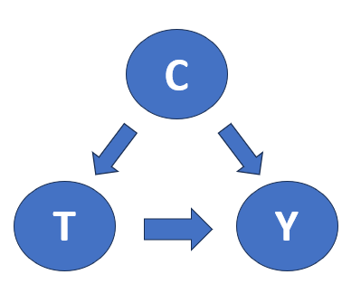
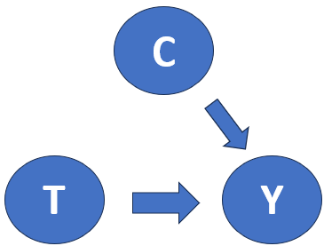

# 前言
我原本是在做關於貝爾不等式的研究時，看到有些方法是基於因果模型。

以前看的相關研究就覺得雲裡霧裡的，

雖然有關注一下相關的研究，也僅僅只是之到了干預的概念，但並沒有很深刻。

在當兵的時侯拜讀了Judea Pearl的Causality Model, Reasoning and inference, Senond Edtion

對其中的東西理解了一些些，

在這個欄目我會深入淺出的講一下概念，並實作一些範本。

## 相關性v.s因果關係
日常常見很多相關性的定義方式，

往往相關性與因果關係有著密切的關係：

「這個人因為懶惰而導致考試不及格」

「有長期作息不穩定容易導致癌症的發生」

「這支股票因為美國進行降息政策而導致價格下跌」

但又往往不一樣

「富人往往戴得起奢侈品，但戴得起奢起品不一定是富人階級」

奢侈品同時也有社交價值在其中，於是人們會想要購買奢侈品的原因之一

或是我們來看看這些例子

https://www.tylervigen.com/spurious-correlations

美國每年對科學投注的資金與每年自殺上吊人數呈高度正相關

Nicolas cage每年出演的電影數目與每年溺水的人數也成高度正相關

所以美國不要再對科學投資了，跟Nicolas cage不要再演電影了，這樣才能好好降低自殺人數? 不會吧?不會吧?

以上諸多例子，都代表著我們往往看到線圖很像或是從數據上的相關性很強，就見到黑影就開槍，並不是一個合理的因果推斷，

像是像在常用的統計策略或是機器學習都是基於相關性，這會讓泛用性出現問題，或是餵的data不對的時候也會出現一些問題。

**結論：要區分出因果關係需要建立起因果模型**

## 本體論v.s認識論

在許多時候我們觀測各種數據，都是基於相關性，但往往我們想知道的是事情的因果關係

這其實是基於不同的哲學準則來觀測與預測事物，以下我們來以數據科學上面的例子來看

### Bayes詮釋 (Bayes interpretation)

認識論代表著我們是希望透過過往的經驗來更加深對於事物的理解

我們習慣觀察機率分布，時常有時候藉由過往經驗來進行預測

這是基於數據的方式來增強或是削減我們對於機率事件的信任程度

$$P\left( {H|e} \right) = \frac{{P(e|H)P\left( H \right)}}{{P(e)}}$$

其中 $P(H|e)$ 是後驗機率(posteriori probability)，根據過往的證據 $e$ (evidence)去看假設 $H$ (hypothesis)

而 $P(H)$ 被稱為先驗機率(Prior probability)，是根據過往的觀測，前人的經驗所得到的機率

舉例來說：

假如今天火災警報器響起，

(1)在真的火災發生導致響起的機率為0.95 即 P(警報響|火災)=0.05

(2)在沒發生火災的時候導致響起的機率為0.01 即 P(警報響|沒發生火災)=0.01

(3)根據以往的經驗，某間樓發生火災的機率為P(火災)=0.0001

$$P\left( {H|e} \right) = \frac{{P(e|H)P\left( H \right)}}{{P(e)}}{\rm{ = }}\frac{{P(e|H)P\left( H \right)}}{{P(e|H) + P(e| \bot H)}} = \frac{{0.95 \times {{10}^{ - 4}}}}{{0.95 \times {{10}^{ - 4}} + 0.01 \times \left( {1 - {{10}^{ - 4}}} \right)}} \approx 0.00941$$
這意味著我們從過往的經驗，先驗機率 $0.0001$ 增強到後驗機率 $0.00941$
```
import numpy as np
import matplotlib.pyplot as plt
p_eh=0.95
p_enonh=0.01
p_0=0.0001
p_list=[]
def Baysian_loop(p_eh,p_0,p_enonh):
  p=p_eh/(p_eh+p_enonh*(1/p_0-1))
  return p

for i in range(0,10):
  p_list.append(p_0)
  p_i=Baysian_loop(p_eh,p_0,p_enonh)
  p_0=p_i
plt.scatter(range(0,10),p_list)
```
如果我們在經過四個迴圈下 條件機率p(e|H)會趨近於0.99987 越來越接近1
<div align=center></div>
代表著如果我們得知過往的經驗，則我們對這個回顧性支持會越強烈。

### Bayes網路 (Bayes networks)
本體論代表著我們很自然地會去追朔本源，問說一個類別的實體是否存在於最基本的層次上？

去構造因果模型的方式就是使用有向無環圖DAG (Directed acyclic graph)，也被稱為是Bayes網路

$$P\left( {{x_1},......{x_n}} \right) = {\prod _i}P\left( {{x_i}|p{a_i}} \right)$$

整體分布 $P(x_1,......x_n)$ 可以被條件機率所連鎖，其中 $P(x_i|pa_i)$ 變數 $x_i$ 是基於父代變數 $pa_i$的。

舉例來說：

像用於描述所有古典事件著名的隱變量模型(local hidden variable model)可以被圖所表達
<div align=center></div>

$$P(a,b|x,y)=\sum_\lambda P(\lambda) P(a|x,\lambda) P(b|y,\lambda)$$

先提要一下結論：
**無論觀測環境如何改變，因果聯繫都應該是不變的，這符合追求本體論的精神**

**同時，透過機率分布去了解，去量化，又符合經驗論的精神，**

那這跟以往數據學家透過機率分布來認識世界又有什麼程度上的差別呢？

這正是因果推斷要討論的事情，要如何去量化因果關係？以及在何種架構下的因果關係才是合理的？

# 因果推斷幾個層次
以我要去某一間餐廳吃東西 $A$，能吃到好東西 $G$ 所發生的事件為例：

1. **關聯(Association)**：假如我去了某一間餐廳吃東西，我能夠吃到好東西的條件機率 $P(G|A)$ 。關聯的意思是說有可能發生也有可能不發生，DAG裡面包含A跟G兩個事件。
2. **干預(intervenion)**：我已經去了某一間餐廳吃東西，我能夠吃到好東西的條件機率 $P(G|Do(Restaurant=A))$。 干預的意思是說在已經發生的當下，DAG裡面已經把A設為常數。
3. **反事實(Counterfactual)**：在已經去吃了某間餐廳的當下，假如我當初不來吃能夠吃到好東西的條件機率 $(G|Do(Restaurant=A'))$。反事實是包含了A與A'所有的集合。

註：此處的DO算子與條件機率的given有所不同

**Given是還考慮整體DAG的機制**

**DO是已經把前面的變數設置為常數，相當於已經阻斷前面DAG的機制**

# 關聯不等於因果關係
我們來看一下這個例子，教師想要知道說如果我今天派發平板，能不能有效的改善學生的學習成效

https://github.com/matheusfacure/python-causality-handbook/blob/master/causal-inference-for-the-brave-and-true/01-Introduction-To-Causality.ipynb

為了很好說明一下這個例子，我們先定義一下符號

$Y_1$ 的意思是 在接受干預 (Treatment) 的手段後 $T=1$，有受到干預的影響程度 $Y_1$

以下都用這樣的下標來表示

舉裡頭的例子來說，就是有發送平板後 $T=1$，這些學生接收測驗拿到的分數 $Y_1$

很自然的，個別群體的個別處理效應(individual treatment effect)可以很直觀的寫成
$${Y_{1i}} - {Y_{0i}}$$
如果有好幾個群體就可以取期望值或者平均，即平均處理效應(average treatment effect)，簡稱 $ATE$
$$E\left( {{Y_1} - {Y_0}} \right)$$
## 混淆因子(Confounding factor)
我們可以思考一下，要怎麼樣設計一個實驗才能說明派發平板 $T$ 會不會影響到學生的成績 $Y$。我們可以要先想一下有什麼事情還會影響到學生的學習成效？例如說一個學校本身資源的豐富性，或是這間學校的率取分數本來就很高，所以進來的學生成績表現就比較好，這些會共同原因(Common cause)，都可以叫做混淆因子(Confounding factor)

<div align=center></div>

接下來我們會介紹要怎麼比較general的把這些混淆因子考慮進去

## 反事實

前面介紹完了混淆因子的概念，以上面的例子來說，假如今天已經是拿到平板的學生，今天沒有拿到的情況下會怎麼樣？如果說還是表現得很好，是不是就說明，有沒有拿到平板其實就沒那麼顯著，這邊的概念就是所謂的反事實。以下為了很好的量化因果關係，處理族群的平均處理效果(average treatment effect on the treated)由以下定義，簡稱 $ATT$
$$E\left( {{Y_1} - {Y_0}{\rm{|}} {\rm{T = 1}}} \right)$$
在 $ATT$ 前面那項 $E(Y_1|T=1)$ 就等同於$E(Y_1)$，是正常人類可以看的到的東西
，但後者 $E(Y_0|T=1)$ 的意思是什麼？ 現在假想一下我們已經做完了實驗 $Y_0$，讓我們有超能力，回到過去再做一次實驗但是這次我們是做 $T=1$ 


**就是在沒有受到處理的群體，假如當初有受到處理會怎麼樣**


在現實中，它往往很難被精準測量，只是我們從理想上這樣的概念應該可以被定義，現在我們來看文中提到的例子( 假設你今天有超能力可以知道所有的反事實)

假如今天學校想要知道能不藉由平板提高學生的學習成績

$Y_1$ 為沒有給平板的學生

$Y_0$ 為有給平板的學生

在這邊T標籤可以理解為假如給了或假如沒給


```
import pandas as pd
import numpy as np

pd.DataFrame(dict(
    i= [1,2,3,4],
    Y0=[500,600,800,700],
    Y1=[450,600,600,750],
    T= [0,0,1,1],
    Y= [500,600,600,750],
    TE=[-50,0,-200,50],
))
```
```
   i   Y0   Y1  T    Y   TE
0  1  500  450  0  500  -50
1  2  600  600  0  600    0
2  3  800  600  1  600 -200
3  4  700  750  1  750   50
```
TE那欄都是Y1-Y0的結果

根據ATE的定義，
$$ATE = \left( { - 50 + 0 +  - 200 + 50} \right)/4$$
根據ATT的定義，
$$ATT = \left( { - 200 + 50} \right)/ - 75$$

從ATE的定義，我們就是關聯性(Correlation)來著手，不管圖怎麼樣，看到結果按照個體數目平均一下就完事。

而從ATT的定義，這個時候需要的資訊又更多了，還需要知道那些是假如接受手段的群體

**ATE跟ATT的差別在，前者考慮了所有的有無接受的群體，後者是只考慮假如接受手段的群體**

前面是我們假設有超能力可以看到反事實的部分，我們來看看通常在現實上看到的表格會長什麼樣的子
```
pd.DataFrame(dict(
    i= [1,2,3,4],
    Y0=[500,600,np.nan,np.nan],
    Y1=[np.nan,np.nan,600,750],
    T= [0,0,1,1],
    Y= [500,600,600,750],
    TE=[np.nan,np.nan,np.nan,np.nan],
))
```
```
   i     Y0     Y1  T    Y  TE
0  1  500.0    NaN  0  500 NaN
1  2  600.0    NaN  0  600 NaN
2  3    NaN  600.0  1  600 NaN
3  4    NaN  750.0  1  750 NaN
```

但往往理想很美好，現實很骨感，nan表格通常是一無所知的

這個時候就有人問了，如果我把群體的標籤拿掉，我能不能直接用 $Y_1$ - $Y_0$

從直覺上會覺得這當然不行，他們本來就是不一樣的群體，這樣DATA裡面就會有偏差BIAS

用裡面的例子來說就是，可能A學校它們的師資，跟入學學生的PR就足夠高，導致不管他們有沒有拿到平板，考的分數都爆高

但往往這就是實際上會面對到的問題，你怎麼知道你取的這些資料，他們是不是在自於同一個群體？

基於這種無知，所以我們通常觀察的東西是根據關聯性 (Correlation)
$$E\left( {Y{\rm{|}} {\rm{T = 1}}} \right) - E\left( {Y{\rm{|}} {\rm{T = 0}}} \right)$$
仔細一看，跟前面做比較它的意思就是，你沒辦法區分出哪些是特定的群體，並再更進一步給予下標0或1

我們藉由增加反事實的項可以進一步推導：

$$E\left( {Y{\rm{|}} {\rm{T = 1}}} \right) - E\left( {Y{\rm{|}} {\rm{T = 0}}} \right)=E\left( {Y{\rm{|T = 1}}} \right) - E\left( {Y{\rm{|T = 0}}} \right) = E\left( {{Y_1}{\rm{|T = 1}}} \right) - E\left( {{Y_0}{\rm{|T = 0}}} \right) + E\left( {{Y_0}{\rm{|T = 1}}} \right) - E\left( {{Y_0}{\rm{|T = 1}}} \right) = ATT + E\left( {{Y_0}{\rm{|T = 1}}} \right) - E\left( {{Y_0}{\rm{|T = 0}}} \right)$$

左式代表的是關聯性從ATE給出定義，右式ATT的部分代表的是我們想描述的因果關係以及

後面的 $E\left( {{Y_0}{\rm{|T = 1}}} \right) - E\left( {{Y_0}{\rm{|T = 0}}} \right)$ 我們就說這是偏差 (BIAS)

那在什麼時後因果關係ATT可以等同於相關性ATE呢？

當偏差等於零的時候

意思是「假如有接受手段的人群，他們沒有接受手段的分數」與「假如沒有接受手段的人群，他們在沒有接受手段的之後分數」，換句話說就是在接受手段前，這兩個群體的差異。在此我們通常知道後者，而無法得知前者。

以當前這個例子來說，在給平板之前，有給的群體可能資源比較充裕，沒給的資源比較貧瘠，
**在給之前這兩個群體就是有差異的**


這邊我們思考一下就會理解偏差零代表，**他們是來自同一個群體**

所以在很多統計上面，兩個群體有相同的標準差，就說明可能來自同個母體，同時就可以做很多事情。

如果他們是同一個群體，那就可以開心做比較啦!

所以通常我們在處理資料的時候，我們要盡力去做一件事情就是去**消除資料本身的偏差**

最簡單的方式就是去做**隨機化**，意思是說我們藉由抽樣讓窮學校跟有錢的學校盡量被抽同樣多次並同時接受手段干涉，融合成一個新群體。

新群體就比較沒有偏差，這個時候關聯性就比較接近因果關係了！

回到我們提到混淆因子的那張圖，我們要做的事情就是要想辦法變成下面這張圖

<div align=center></div>

這邊可以做很多的方式，其中一種隨機化的方式可以參考以下

Fisher-randomization.md

# 延伸閱讀
因果推論在行銷上的應用

https://medium.com/twdsmeetup/twds-causal-inference-in-marketing-david-huang-4485184dbdb7

因果推論簡介：A/B Testing 行不通時怎麼辦？

https://haosquare.com/causal-inference-intro/

別人寫的handbook，還附帶py code 讚讚
https://github.com/matheusfacure/python-causality-handbook
