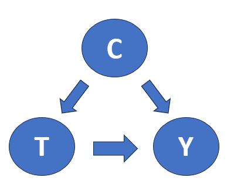
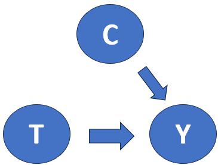

# 干預(intervention) Do算子與Thomson paradox
## 前言
我們前面有提過當遇到有混淆因子的狀況
<div align=center></div>

我們想做的事情想要排除掉混淆因子對我們想看到的治療手段的影響

<div align=center></div>

以下我們會介紹DO算子，來方便我們去做這樣的計算與處理
## Thompson_paradox
這裡我們舉一個干預的例子

假設今天我們做了一個藥物實驗，
```
treatment_A_dead_number=[210,30]
treatment_B_dead_number=[5,100]
treatment_A_number=[1400,100]
treatment_B_number=[50,500]
data_dead_number={'treatment_A':treatment_A_dead_number,'treatment_B':treatment_B_dead_number}
data_dead_number=pd.DataFrame(data_dead_number,index=['mild','severe']).T
data_number={'treatment_A':treatment_A_number,'treatment_B':treatment_B_number}
data_number=pd.DataFrame(data_number,index=['mild','severe']).T

data_number=data_number.assign(total=data_number.sum(axis=1))
data_dead_number=data_dead_number.assign(total=data_dead_number.sum(axis=1))
```
dead_number是實驗對應到的總人數
```
             mild  severe  total
treatment_A  1400     100   1500
treatment_B    50     500    550
```
而dead_number是經藥物仍舊死亡的人數
```
             mild  severe  total
treatment_A   210      30    240
treatment_B     5     100    105
```

如果我們稍微看一下簡單的表格
```
             mild  severe     total
treatment_A  0.15     0.3  0.160000
treatment_B  0.10     0.2  0.190909
```

就會發現當我們對病人的症狀進行分類後，跟沒分類前的結果完全不同

讓我們要如何知道治療是真正有效的呢？


根據intervention算子do的定義

$$E(Y|do(T=t))=\sum_cE(Y|t,c)p(c)$$

```

def create_intervention_AB(data_number,data_dead_number):
    indexes=data_number.index
    data_rates=data_dead_number/data_number
    data_rates=data_rates.rename(columns={'total':'correlation'})


    new_list=[]
    c_numbers=data_number.sum()
    for i in range(data_rates.shape[0]):
        tmp_sum=0
        for j in range(data_rates.shape[1]-1):
            E_y_given_t_c=data_rates.iloc[i,j]
            p_c=c_numbers.iloc[j]/c_numbers.iloc[-1]
            tmp_sum=tmp_sum+E_y_given_t_c*p_c
        new_list.append(tmp_sum)
    new_list=pd.DataFrame({'intervention':new_list},index=indexes)
    data_rates=pd.concat([data_rates,new_list],axis=1)
    return data_rates

data_rates=create_intervention_AB(data_number,data_dead_number)
```
從結果可以看到經過intervention後correlation跟intervention兩個數值反而是相反的
```
             mild  severe  correlation  intervention
treatment_A  0.15     0.3     0.160000      0.193902
treatment_B  0.10     0.2     0.190909      0.129268
```
如果我們只是巨觀的去看總人數，我們會覺得A好像是比較有效的

但考慮這些症狀輕微與否也會影響到治療的成效，就考慮為他們的共同原因(Common cause)

從公式上我們就是對這些症狀的條件機率再考慮上人數所佔的加權

我們就可以利用intervention 排除掉這個因素