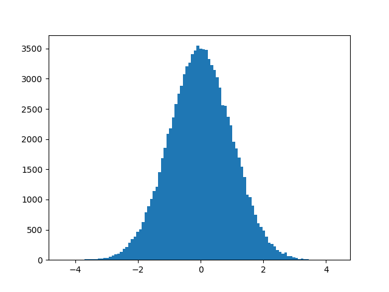

# 前言
有關於統計的雜七雜八的可能會放在這

# 不偏估計量

在母體的變異數我們通常會寫成

$$V=\frac{1}{N}\sum(X_i-\bar{X})^2$$

但是在抽樣之後的變異數為

$$V'=\frac{1}{N-1}\sum(X_i-\bar{X})^2$$

為什麼是減一，因為你知道其他(N-1)的資訊剩下來的1也就會自然知道了

從後面的推導會說明怎麼得到這個結論

在老老實實推導之前，我們來試著回答看看一個好的統計量應該要符合哪些性值

1. 不偏性
2. 一致性
3. 充分性

此篇的重點在於不偏性，也就是在我們定義某個統計量後，任意抽取之後，也要保持跟母體同樣的值

$$E(\hat{\theta})=\theta$$

例如說平均

$$
E(\bar{x})=E\left(\frac{x_1+x_2+\cdots+x_n}{n}\right)=\bar{X}
$$

## 推導
### 平均
我們來取一下對於取樣後的平均，取樣數為N取n種
$$
E(\mu)=\frac{1}{C^N_n} \sum \frac{\bar{x}}{n} =\frac{n !(N-n) !}{ N !} \sum\left(x_i\right)
$$

這裡對 $\sum(x_i)$ 做代換 (-1的原因是因為你知道其他的就知道最後一個是誰了)

$$\sum{x_i}=C^{N-1}_{n-1}\sum(X_i)$$

全部帶入
$$
\begin{aligned}
E(\bar{x}) & =\frac{n !(N-n) !}{n \cdot N !} \cdot \frac{(N-1) !}{(n-1) !(N-n) !} \cdot\left(X_1+X_2+\cdots+X_N\right) \\
& =\frac{X_1+X_2+\cdots+X_N}{N} \\
& =\bar{X}
\end{aligned}
$$


### 變異數

再來是變異數
$$
E(v)=\frac{1}{N}E(\sum_i(x_i-\bar{x})^2)=\frac{1}{N}E(\sum_i(x_i+\bar{X}-\bar{X}+\bar{x})^2)
$$

$$E(v)=\frac{1}{N} \sum(x_i-\bar{X})^2-n(\bar{x}-\bar{X})^2$$

前項 $\frac{1}{N} \sum(x_i-\bar{X})^2=\frac{1}{N} \sum(X_i-\bar{X})^2$

後項 $(\bar{x}-\bar{X})^2$

$$
\begin{aligned}
& =\frac{1}{n^2} E\left[\sum_{i=1}^n\left(x_i-\bar{X}\right)^2\right]+\frac{1}{n^2} E\left[\sum_{i \neq j}^n\left(x_i-\bar{X}\right)\left(x_j-\bar{X}\right)\right] \\
& =\frac{1}{n^2} \cdot \frac{\left(\begin{array}{c}
N-1 \\
n-1
\end{array}\right)}{\left(\begin{array}{c}
N \\
n
\end{array}\right)} \sum_{i=1}^N\left(X_i-\bar{X}\right)^2+\frac{1}{n^2} \frac{\left(\begin{array}{c}
N-2 \\
n-2
\end{array}\right)}{\left(\begin{array}{c}
N \\
n
\end{array}\right)} \sum_{i \neq j}^N\left(X_i-\bar{X}\right)\left(X_j-\bar{X}\right) \\
& =\frac{1}{n N} \sum_{i=1}^N\left(X_i-\bar{X}\right)^2-\frac{1}{n^2} \cdot \frac{n(n-1)}{N(N-1)} \cdot \sum_{i=1}^N\left(X_i-\bar{X}\right)^2 \\
& =\frac{N-n}{n N(N-1)} \sum_{i=1}^N\left(X_i-\bar{X}\right)^2
\end{aligned}
$$

總和起來

$$
\begin{aligned}
E(v) & =\left[\frac{1}{N}-\frac{N-n}{n N(N-1)}\right] \cdot \sum_{i=1}^N\left(X_i-\bar{X}\right)^2 \\
& =\frac{n-1}{n} \cdot \frac{1}{N-1} \cdot \sum_{i=1}^N\left(X_i-\bar{X}\right)^2
\end{aligned}
$$
從這邊就可以看到v不是一個不偏統計量，但是只要令$v'=\frac{1}{n-1}(x_i-\bar{x})^2$，上面的等式就可以換成下面

$$E(v')=\frac{1}{N-1}\sum({X_i-\bar{X}})^2$$


# Confidence Intervals (信賴區間)
對於頻率學派心中的想像，資料是怎麼產生的這個過程應該是理想的，

也就是說，當頭的參數雖然未知但亙古不變，只要我們做的夠多次實驗

就可以收集到那些真知灼見

```
import numpy as np
import matplotlib.pyplot as plt
n=1000000
data=np.random.normal(0,1,n)

plt.hist(data,bins=100)
plt.show()

cond_list=[data>2,data<-2]
choice_list=[1,1]
print(1-sum(np.select(cond_list,choice_list,default=0))/n)
```
```
0.954466
```
<div align=center></div>   

在理想上，如果我們根據-2~2標準差之間，應該就可以涵蓋大約95.4%的分布

這樣的95.4%我們就說是一個信賴 (confidence)。

如果我們今天得知標準差跟平均，那麼就可以在理想中構建這樣一個信賴區間可以涵蓋95.4%的數據

但並不代表是真實數據就是常態分布，也不等同從真實數據在兩個標準差內就可以涵蓋95.4%的數據

則區間就是+-2個標準差

## Probability density function

在給定標準差跟平均後，在實作上可以用pdf(probability density function)函數從x找對應分布
```
from scipy import stats
exp_mu=0
exp_se=1
x = np.linspace(exp_mu - 4*exp_se, exp_mu + 4*exp_se, 100)
y = stats.norm.pdf(x, exp_mu, exp_se)
plt.plot(x, y)
```

## Cumulative Distribution Function

cdf(Cumulative Distribution Function)可以把pdf裡的面積累加起來，

算一下從-inf到兩倍的標準差可以涵蓋多少面積

```
c = stats.norm.cdf(2, exp_mu, exp_se)
### c是從-inf開始積到2
print(c)
print((c-0.5)*2)

```

```
0.9772498680518208 #從0到2
0.9544997361036416 #從-2到2
```

## Probability Point Function

ppf (Probability Point Function) 則是cdf的反函數
```
x_prime = stats.norm.ppf(c, exp_mu, exp_se)
print(x_prime)

```
```
2.0000000000000004
```

# Hypothesis Testing: z-test and p-value
在統計上面，我們常常做的事情就是去比較兩個分佈到底長的一不一樣

例如耳熟能詳的AB test

通常我們會將兩個分布做相減

$$N(\mu_1,\sigma_1^2)-N(\mu_2,\sigma_2^2)=N(\mu_1-\mu_2,\sigma_1^2+\sigma_2^2)$$

量測兩個分布之間的距離有很多種方式，首先來定義一下p-value

P value 是考慮在虛無假說的情況下，data出現的條件機率 $p(data|H_0)$

越大代表接受虛無假說的程度越大

假如說今天我想要知道兩個班級的體重分佈有沒有統計上的差異

在這邊具體的做法就是將體重差，那些處於極端狀況的機率分布給加起來

換個說法就是tail probability，把尾巴的機率分布P都積起來

如果這個值越大就代表即使在極端狀況，兩個班級的分布越接近相同

我們會先做Z統計，就是標準化

這裡先做一個簡單的p-value例子 從-inf 到 $z=2$ 算一下這裡對應的機率分布上的面積(單尾的)
```
c=stats.norm.cdf(2, exp_mu, exp_se)
print(1-c)
```
```
0.02275013194817921
```


我們這邊可以來看一下這個體重的例子
```
import numpy as np
from scipy import stats
from statsmodels.stats.weightstats import ztest
import math
data1 = [650,730,510,670,480,800,690,530,590,620,710,670,640,780,650,490,800,600,510,700]
data2 = [630,720,462,631,440,783,673,519,543,579,677,649,632,768,615,463,781,563,488,650]

sample_mean1 = np.mean(data1)
sample_mean2 = np.mean(data2)
sample_size1 = np.count_nonzero(data1)
sample_size2 = np.count_nonzero(data2)
population_mean_diff = 0
population_std1 = np.std(data1,ddof=1)
population_std2 = np.std(data2,ddof=1)
###以下設定alpha=0.05，大於此則接受H0，小於則拒絕
alpha = 0.05
```

在應用Z-test有一個前提，就是必須符合常態分佈

應用上我們需要先使用stats.shapiro先看看我們的樣本符不符合常態分佈
```
###H0：此分布常態分佈
print(stats.shapiro(data1))
print(stats.shapiro(data2))
```
```
ShapiroResult(statistic=0.9491580724716187, pvalue=0.35449090600013733)
ShapiroResult(statistic=0.9538031220436096, pvalue=0.4285224676132202)
pvalue大於alpha設定，所以接受H0
```
再來我們來正式看看Z分數在兩個樣本下怎麼定義
$$Z=\frac{\mu_2-\mu_1}{\sqrt{\sigma_1^2/n_1+\sigma_2^2/n_2}}$$
分子是你要比較的兩個對象兩者之間的平均差

分母是兩個set合起來等價後的標準差，相當於根據sample數進行了縮放
```
###Method 1: Using built in function of ztest

z,p = ztest(x1=data1,x2=data2,value=population_mean_diff,alternative='two-sided')
print('Z-score:',z,'\nP-value:',p)
 
    
###Method 2: Calculating Z-score  

zscore = ((sample_mean1-sample_mean2)-(population_mean_diff))/(math.sqrt((population_std1**2/sample_size1)+(population_std2**2/sample_size2)))
print('z_score',zscore)
print('p_value',(1-stats.norm.cdf(zscore))*2)
```

```
Z-score: 0.8510499900002724
P-value: 0.39474158407539195
z_score 0.8510499900002724
p_value 0.39474158407539184

p_value>alpha 接受虛無假設，即兩個set差不多
```

# T-test

# Moivre’s equation

假設母體跟抽樣後的樣本遵從I.I.D.

母體標準差 為 $\sigma$ ， 抽取無限多個大小為 $n$ 的樣本，則 

則在這個大小下的均值標準差可以寫作

$$Var(\frac{1}{n}) \sum X_i = \frac{1}{n^2}  Var\sum(X_i)= \frac{\sigma^2}{n}$$


$$SE=\frac{\sigma}{\sqrt{n}}$$

# Moivre’s equation
以下我們考慮Bernoilli 試驗(trials)

假設事件A發生的機率為p

在事件A出現k的次可以寫作

$$
P_n(k)=\left(\begin{array}{l}
n \\
k
\end{array}\right) p^k q^{n-k}=\frac{n !}{k !(n-k) !} p^k q^{n-k}
$$


## de Moivre-Laplace 定理
若npq很大，且k接近np
$$
P_n(k)=\left(\begin{array}{l}
n \\
k
\end{array}\right) p^k q^{n-k} \simeq \frac{1}{\sqrt{2 \pi n p q}} e^{-\frac{(k-n p)^2}{2 n p q}}
$$